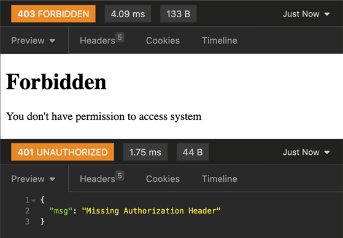
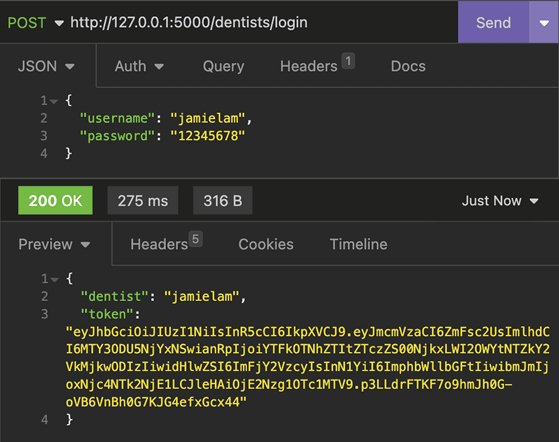
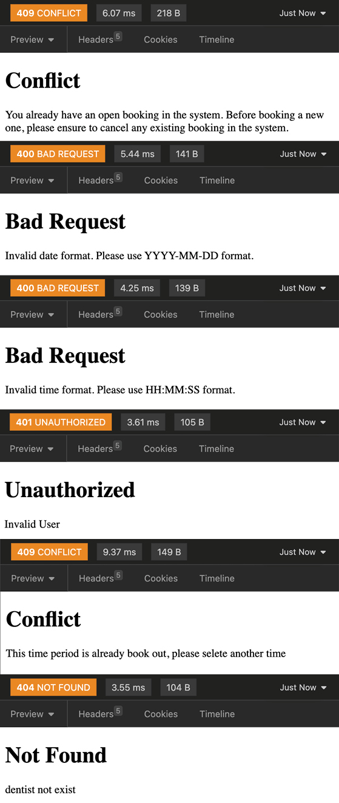
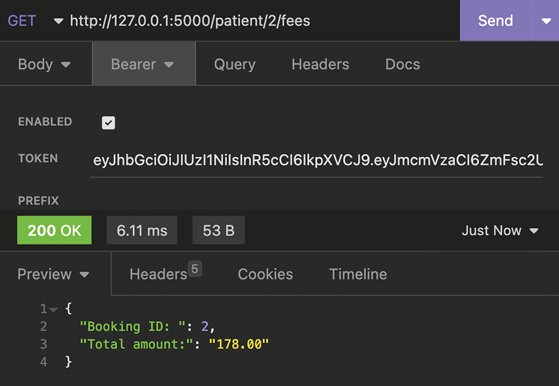
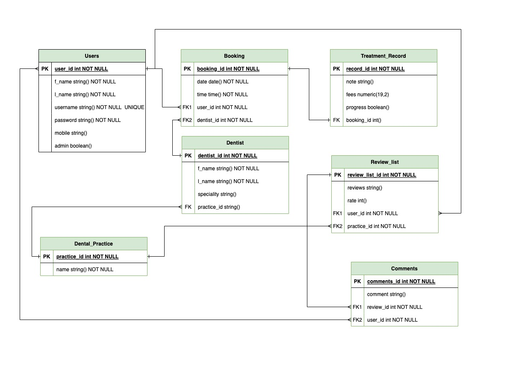

# R1. Identification of the problem you are trying to solve by building this particular app.

The app I built is a dental practice online booking system. I was talking with my friends and some of them are dentists, they said most dental practices in Australia still rely on phone call systems for booking appointments. Cause most of the practice is only 1-3 dentists, implementing an online booking system can require additional investment and staff training. This may not be feasible for smaller dental practices or those with limited resources.

***

# R2. Why is it a problem that needs solving?

There are lots of benefits of transferring from a phone call booking system to an online booking system for dental practices, even a small one.

Firstly, an online booking system allows patients to book appointments at any time, even outside of office hours. This convenience can increase patient satisfaction and attract new patients. It also can reduce the workload for reception staff, freeing up their time to focus on other tasks. Cause most of time, the reception staff also work as a dental assistent in some practice. This can lead to increased efficiency and productivity within the practice.

Patients can select from available time slots in real-time, ensuring accuracy and avoiding scheduling conflicts with the online booking system. Beside that, it can provide valuable data insights for dental practices, such as appointment history and patient demographics. This information can be used to improve patient experience and inform marketing strategies.

Finally, an online booking system can enhance communication between the practice and patients. Reminders and notifications can be automated, reducing no-shows and improving patient engagement.

Overall, transferring from a phone call booking system to an online booking system can provide numerous benefits for dental practices, including increased convenience, efficiency, accuracy, data insights, and patient engagement.

***

# R3. Why have you chosen this database system. What are the drawbacks compared to others?

I choose PostgreSQL database system for this project because it is an open source relational database management system. Since this project is about to build an API websever, I probably need to deal with a lots of JSON data. Because PostgreSQL allows JSON data to be stored as a native data type, which allows for efficient storage and retrieval of JSON data. It also provides a range of JSON fucntions and operators that allow for complex queries and manipulation of JSON data within the database. Beside that, PostgreSQL has strong security features, including SSL support, granular access controls, and encryption options. This makes it a good choice that handle sensitive data cause the booking system will have username and password.

The main drawbacks of PostgreSQL database system is it's complexity. It is a complex system that can be challenging for beginners. That means it has a steeper learning curve and may require more time and resources to set up and manage. PostgreSQL may perfor worse than others in some scenarios, like read-heavy workloads. The other drawback could be lack of third party tools and applications that are compatible with. For example, MySQL is more widely used and it easier to integrate into an existing technology stack.


ref: https://developer.okta.com/blog/2019/07/19/mysql-vs-postgres

***

# R4. Identify and discuss the key functionalities and benefits of an ORM

An ORM (Object-Relational Mapping) is a technique in programming that enables developers to establish a link between a relational database and an object-oriented programming language. By introducing a layer of abstraction between the application and the database, an ORM tool facilitates the manipulation of objects instead of tables and SQL queries.

Here are some key functionalities of ORM

1. Mapping between database tables and object-oriented classes:
- This allows developers to work with objects that represent database records, rather than dealing directly with the tables and records in the database. For example, in this project I have a table "users" in PostgreSQL database that stores information about users can be mapped to a User class in python.

2. Automatic generation of SQL queries.
- ORM tools can generate SQL queries automatically to perform database operations. Still use my project as example 

    ```py
    user = User.query.filter_by(username=user_name).first()
    user.f_name = "Eddy"
    db.session.commit()
    ```
    The ORM tool will automatically generate the SQL query to update the f_name of the user with the username = user_name based on the User Model, it saves developers time and effort.

3. Provides transaction management:
- In a transaction, all operations must either succeed or fail as a whole. If any operation in the transaction fails, the entire transaction is rolled back, and the database is left in its original state before the transaction began. This helps prevent data inconsistencies and ensure the data integrity. For example, if you have an e-commerce website. When a user purchases a product, the database must be updated to reflect the transaction. This involves subtracting the price of the product from the user's account balance, updating the inventory of the product, and recording the transaction in the order history. If any of these operations fail, the entire transaction must be rolled back, so the user's account balance is not incorrectly updated, the product inventory is not incorrectly reduced, and the order history is not incorrectly recorded. 

4. Provides security features.
- ORM tools provide security features such as parameterized queries, input validation, and protection against SQL injection attacks. This helps ensure that the application is secure and that data is protected from unauthorized access. For example, in this project, we define an ORM model for users table using SQLalchemy. If we try to find specific user, we use 
   ```
   user = User.query.filter_by(username=user_name).first()
   ```

   this is equal to 
   ```sql
   SELECT * FROM users WHERE username = :user_name LIMIT 1
   ```
   The username parameter is automatically escaped and sanitized by SQLAlchemy, preventing any attempt to inject malicious SQL code.

5. Provides support for database schema generation and migration.
- ORM tools can generate and update database schema automatically based on changes in the object model, making it easier to manage changes to the database schema over time.

6. Offers database abstraction
- ORM tools provide database abstraction, which allows developers to switch between different database systems without changing the code. For example, if a developer is using an ORM tool to interact with a MySQL database, they can switch to a PostgreSQL database by changing the database connection string without changing the code that interacts with the database.

***

# R5. Document all endpoints for your API

### 1. (GET) Home Page (Everyone can access)

http://127.0.0.1:5000/home


***

### 2. (GET) All dentists general infomation (Everyone can access)

http://127.0.0.1:5000/dentists


***

### 3. (POST) User/Admin Login

http://127.0.0.1:5000/auth/login

Required data:
```json
{
	"username": "eddyzhou",
	"password": "12345678"
}
```


If there is anything missing (username/password) in Json file, error will be handled.


If the username or password is not correct


### 4. (POST) Signup new user

http://127.0.0.1:5000/auth/signup

Required data:
```json
{
	"f_name": "Abbey",
	"l_name": "Spence",
	"username": "abbeyspence",
	"password": "12345678",
	"mobile": "0433512626"
}
```


Below are some errors handling when request json file has some wrong inputs

From top to bottom

1. username data is missing
2. password is too short, less than 8
3. typo for "f_", should be "f_name"
4. username already been used


***

### 5. (GET) Admin get all users' info (Only Admin can access)

http://127.0.0.1:5000/auth/users

Need access token from Admin Account, login admin account to get the token
Admin account username: eddyzhou, password: 12345678


Other returns when token is not given or not an Admin account



***

### 6. (POST) Dentist Login

http://127.0.0.1:5000/dentists/login

Required data:
```json
{
	"username": "jamielam",
	"password": "12345678"
}
```



Same as the user login, other returns should be handled as

From top to bottom

1. typo for "passwords", should be "password"
2. password is not correct
3. username is not correct


***

### 7. (POST) Admin create dentist account (Only Admin can do it)

Required data:
```json
{
	"f_name": "Jenny",
	"l_name": "Leung",
	"username": "jenneung",
	"password": "12345678",
	"speciality": "General"
}
```
Need access token from Admin Account, login admin account to get the token
Admin account username: eddyzhou, password: 12345678


Same as the user registeration, other returns should be handled as

From top to bottom

1. username must longer than 4 characters and password should not less than 8 characters
2. dentist's username already been used
3. this is not a admin account


***

### 8. (GET) Users get their personal info (booking,treatment detials)

Authentication: 
Need access token from specific User Account, login any user account to get the token

http://127.0.0.1:5000/patient/info


***

### 9. (POST) User booking an dental appointment (user account access)

Required data:
```json
{
	"date": "2023-05-23",
	"time": "16:00:00"
}
```

Authentication: 
Need access token from specific User Account, login any user account to get the token

http://127.0.0.1:5000/dentists/1/booking

The number(1) in http request is represent the dentist id


The booking part is the most complicated part in this API app.
There will be a lots of logical restriction related to this booking request. Here are some of them listed below.

1. Only authenticated user can use booking request
2. The input request for "date" and "time" format should be varified
3. There should be only 1 "Open" booking in user's account, ("Open" booking means user make the appointment, but haven't seen the dentist yet). Once user finished this dental appointment, the status of this booking will change to "Close", then user can make another booking cause there is no "Open" booking under his name. This is used to avoid a user repeatedly making bookings and occupying time slots, preventing other users from being able to book. (If user want to book another time, he need to delete that open booking first)
4. I set each dental appointment is 30 min. Therefore, if that dentist is already booked on that date and time. User need to choose another date or time to book with him. For example: if User A booked Dentist E on April 5th at 16:00:00, then User B can't not book with Dentist E on that date and time, and because of 30 min appointment time, the actual blocked booking time slot is between 15:30:01 to 16:29:59. That means either User B book with another dentist or change another date or choose the time other than 15:30:01-16:29:59.


Here are some returns should be handled as

From top to bottom

1. user already has an "Open" booking in the system, need to delete that one before making a new booking
2. the date format should be YYYY-MM-DD
3. the time format should be HH:MM:SS
4. not a valid user, need a valid token to access booking request
5. the booking time user selected is not avaliable, conlict with other user's booking
6. the dentist id is not exist



***

### 10. (DELETE) User delete an "Open" booking under his account (user account access)

Authentication: 
Need access token from specific User Account, login any user account to get the token

http://127.0.0.1:5000/patient/cancel

This is just delete the "Open" booking, other "Close" bookings under that user's name will still be there as records. Return will be all that user's info with his records.


If there is no "Open" booking under user's account, should return as following


***

### 11. (PUT) Dentist change the status of a booking from "Open" to "Close" (dentist account access)

Authentication: 
Need access token from specific Dentist Account, login any dentist account to get the token

http://127.0.0.1:5000/dentists/3/close

The number(3) in http request is represent the booking id


Here are some returns should be handled as
From top to bottom

1. This booking is already closed
2. The booking id in the request is not belongs to you, that means you can't modify other dentist's patient booking
3. Need valid dentist token to access


***

### 12. (POST) Dentist add treatments under his booking (dentist account access)

Required data:
```json
{
	"service": "Full mouth xray",
	"fee": 120
}
```

Authentication: 
Need access token from specific Dentist Account, login any dentist account to get the token

http://127.0.0.1:5000/dentists/2/add

The number(2) in http request is represent the booking id


Here are some returns should be handled as
From top to bottom

1. This booking is belongs to other dentist, you can't add treatments under that booking
2. The booking id is not exist.


***

### 13. (GET) Admin can check all bookings info (Admin account access)

http://127.0.0.1:5000/patient/bookings

Authentication: 
Need access token from Admin Account, login Admin account to get the token
Admin account username: eddyzhou, password: 12345678


***

### 14. (GET) Admin can check single user info based on user id (Admin account access)

http://127.0.0.1:5000/auth/user/2

Authentication: 
Need access token from Admin Account, login Admin account to get the token
Admin account username: eddyzhou, password: 12345678

The number(2) in http request is represent the user id


***

### 15. (PUT) User update their personal info (User account access)

http://127.0.0.1:5000/patient/update

Authentication: 
Need access token from User Account, login User account to get the token


In the json file, you can only update "f_name", "l_name" or "mobile", but not "username" and "password".

***

### 16. (DELETE) Admin delete user account (Admin account access)

http://127.0.0.1:5000/auth/user/delete/3

Authentication: 
Need access token from Admin Account, login Admin account to get the token
Admin account username: eddyzhou, password: 12345678

The number(3) in http request is represent the user id


Here are some returns should be handled as
From top to bottom

1. user id is not exist in the database
2. only admin account can access this request
3. even the admin can't delete the admin account


***

### 17. (DELETE) Admin delete dentist account (Admin account access)

http://127.0.0.1:5000/auth/dentist/delete/3

Authentication: 
Need access token from Admin Account, login Admin account to get the token
Admin account username: eddyzhou, password: 12345678

The number(3) in http request is represent the dentist id


***

### 18. (DELETE) Dentist delete treatments (Dentist account access)

http://127.0.0.1:5000/dentists/5/3/delete

Authentication: 
Need access token from Dentist Account, login dentist account to get the token

The first number(5) in http request is represent the booking id, the second number(3) in http request is for treatment id


Here are some returns should be handled as
From top to bottom

1. Can't find the treatment
2. the booking is belong to other dentists, you can't modify this patient record
3. can't find this booking in database
4. unthenticated dentist account, invalid token


***

### 19. (PUT) Dentist update treatments (Dentist account access)

Required data:
```json
{
	"service": "Limited exam",
	"fee": 58
}
```

http://127.0.0.1:5000/dentists/2/1/update

Authentication: 
Need access token from Dentist Account, login dentist account to get the token

The first number(2) in http request is represent the booking id, the second number(1) in http request is for treatment id

You can update either "service" or "fee", or both of them.


Here are some returns should be handled same as dentist delete treatments

1. Can't find the treatment (second treatment id is not exist)
2. the booking is belong to other dentists, you can't modify this patient record (first booking id is not under this dentist name)
3. can't find this booking in database (first booking id is not exist)
4. unthenticated dentist account, invalid token 

***

### 20. (GET) User get total amount of fee from a booking (User account access)


http://127.0.0.1:5000/patient/2/fees

Authentication: 
Need access token from User Account, login user account to get the token

The number(2) in http request is represent the booking id




Here are some other returns should be handled as

1. the booking id in http request should exist, otherwise give error message
2. the booking is belong to other users, you can't check anything related to this booking id
3. unthenticated user account, invalid token

***

### 21. (GET) Search dentists based on the speciality (Anyone can access)


http://127.0.0.1:5000/dentists/search?speciality=General


***

### 21. (GET) Admin search all open bookings (admin can access)

Authentication: 
Need access token from Admin Account, login Admin account to get the token
Admin account username: eddyzhou, password: 12345678


http://127.0.0.1:5000/auth/bookings/search?status=Open


***

### 22. (GET) Dentist get all his bookings (Dentist can access)

Authentication: 
Need access token from Dentist Account, login Dentist account to get the token


http://127.0.0.1:5000/dentists/bookings


***

# R6. An ERD for your app

The original ERD when submit on the discord



After discuss, the final ERD more focus on the core functions


# R7. Detail any third party services that your app will use

###  1. SQLAlchemy
```py
from flask_sqlalchemy import SQLAlchemy

db = SQLAlchemy()
```

SQLAlchemy is a Python library that provides a set of tools for working with relational databases using an object-relational mapping (ORM) approach.

-----------------

### 2. Marshmallow
```py
from flask_marshmallow import Marshmallow
from marshmallow.validate import Length
from marshmallow.exceptions import ValidationError
```
```py
ma = Marshmallow()
```

Marshmallow allows you to define schemas for your Flask models, making it easy to serialize and deserialize them.

```py
password = ma.String(validate=Length(min=8))
```


```py
#User login the dental system
@auth.post("/login")
def user_login():
    try:
        user_fields = user_schema.load(request.json)
        user = User.query.filter_by(username=user_fields["username"]).first()
        #Verifiy the username and password, let user know which one is not correct.
        if not user:
            return abort(401, description="username is not exist")
        elif not bcrypt.check_password_hash(user.password, user_fields["password"]):
            return abort(401, description="password is not right")
        access_token = create_access_token(identity=str(user.username))
        return jsonify({"user": user.username, "token": access_token})
    except ValidationError:
        return abort(401, description="minimun password length is 8")
```

Using "marshmallow.validate" and "marshmallow.exceptions" can automatically deserialize incoming JSON data and validate it against a Marshmallow schema, helping to ensure that your application receives valid data.

-----
### 3. Bcrypt
```py
from flask_bcrypt import Bcrypt

user_fields = user_schema.load(request.json)
user.username = user_fields["username"]
user.password = bcrypt.generate_password_hash(user_fields["password"]).decode("utf-8")

db.session.add(user)
db.session.commit()
```

Using Bcrypt extension can take a plain text password and converting it into a hashed value that is difficult to reverse.
It helps to protect against common security threats like password cracking and SQL injection.

----------------------------------------

### 4. JWT

```py
from flask_jwt_extended import JWTManager
from flask_jwt_extended import create_access_token
from flask_jwt_extended import jwt_required, get_jwt_identity
```
```py
jwt = JWTManager()

access_token = create_access_token(identity=str(user.username))
```
```py
#Admin delete patient's account
@auth.delete("/user/delete/<int:id>")
@jwt_required()
def delete_user(id):
    user_name = get_jwt_identity()
    user = User.query.filter_by(username=user_name).first()
    if not user:
        return abort(401, description="Invaild user")
    if not user.admin:
        return abort(401, description="Unauthorized user")
    
    patient = User.query.filter_by(id=id).first()
    if not patient:
        return abort(400, description="Can't find that user")
    if patient.admin:
        return abort(400, description="Can't delelte admin account")
    
    db.session.delete(patient)
    db.session.commit()
    return jsonify({"Patient {x} {y}".format(x=patient.f_name, y=patient.l_name): "has been deleted"})
```
We use jwt flask entension to provide JSON Web Token to authenticate and authorize in this app. It provides decorators for easily restricting access to certain endpoints based on the user's permissions.

----------------------------------

### 5. datetime and functools
```py
from datetime import datetime

@dentist.post("/<int:id>/booking")
@jwt_required()
def book_treatment(id):
    user_name = get_jwt_identity()
    user = User.query.filter_by(username=user_name).first()
    if not user:
        return abort(401, description="Invaild user")
    
    booking_fields = booking_schema.load(request.json)

    dentist = Dentist.query.filter_by(id=id).first()

    if not dentist:
        return abort(400, description="dentist not exist")
    
    exist = Booking.query.filter_by(user_id=user.id, status="Open").first()
    if exist:
        return abort(400, description="You already have a open booking in the system. Before booking a new one, please ensure to cancel any existing booking in the system.")

    data = Booking.query.filter_by(dentist_id=id, date=booking_fields["date"])


    for book in data:
        t1 = datetime.strptime(str(book.time), '%H:%M:%S')
        print(t1)
        t2 = datetime.strptime(booking_fields["time"], '%H:%M:%S')
        print(t2)
        delta = t1 - t2
        sec = delta.total_seconds()
        if abs(sec) < 1800:
            return abort(400, description="This time period is already book out, please selete another time")

    booking = Booking()
    booking.date = booking_fields["date"]
    booking.time = booking_fields["time"]
    if "status" in booking_fields:
        booking.status = booking_fields["status"]
    booking.user_id = user.id
    booking.dentist_id = id
    db.session.add(booking)
    db.session.commit()

    return jsonify(booking_schema.dump(booking))

```
The basic idea of a patient booking appointment with a dentist is we assumed each appiontment time for a specific dentist is 30min. So if 16:00:00 is booked, the time slot between 15:30:01 to 16:00:00 and time slot between 16:00:00 to 16:29:59 is not avaliable for any new bookings. Therefore we need to use "datetime.strptime" to calculate the difference between two booking time.

```py
from functools import wraps

def admin_authentication(func):
    @wraps(func)
    def wrapper():
        user_username = get_jwt_identity()
        user = User.query.filter_by(username=user_username).first()
        if not user:
            return abort(400, description="Invalid User")
    
        if not user.admin:
            return abort(400, description="You don't have permission to access system")

        return func()      
    return wrapper

#Only admin account can retrieve all user's information 
@auth.get("/users")
@jwt_required()
@admin_authentication
def get_user():
    # user_name = get_jwt_identity()
    # user = User.query.filter_by(username=user_name).first()
    # if not user:
    #     return abort(401, description="Invaild user")
    # if not user.admin:
    #     return abort(401, description="Unauthorized User")

    users = User.query.all()
    result = users_schema.dump(users)
    return jsonify(result)
```

I create a decorator here to reduce the repeated admin account authentication code in each Endpoint.

--------------------------

### 6. Blueprint

```py
from flask import jsonify, Blueprint

auth = Blueprint('auth', __name__, url_prefix='/auth')
```
I use flask Blueprint in this project to break this application into smaller components, each with its own routes, views, and templates. This makes it easier to manage and maintain this application as it grows.

***

# R8. Describe your projects models in terms of the relationships they have with each other

There are four Models in this project which are "User", "Dentist", "Booking" and "Treatment".

Based on ERD, "User" and "Dentist" has a many to many relationship. Therefor "Booking" is a new Entiry created between them.

Here is "User" Model.

```py
from main import db

class User(db.Model):
    __tablename__ = 'users'
    id = db.Column(db.Integer, primary_key=True)
    f_name = db.Column(db.String(), nullable=False)
    l_name = db.Column(db.String(), nullable=False)
    username = db.Column(db.String(), nullable=False, unique=True)
    password = db.Column(db.String(), nullable=False)
    mobile = db.Column(db.String())
    admin = db.Column(db.Boolean(), default=False)

    booking = db.relationship(
        "Booking",
        backref="user",
        cascade="all, delete"
    )
```

From User Model we can see id is the primary key, the only field is nullable is mobile, and the username should be unique. booking = db.relationship indicate the one to many relation between User and Booking Model, and cascade="all, delete" means if you delete one of the user, all the bookings related to this user will be deleted as well.

The admin field in User Model is used for seperating the normal patient and Admin. Cause some of the requests like create dentist account or check all patients info is prohibited being used or access by normal user/patients.


Next one is Dentist Model:

```py
from main import db

class Dentist(db.Model):
    __tablename__ = 'dentists'
    id = db.Column(db.Integer, primary_key=True)
    f_name = db.Column(db.String(), nullable=False)
    l_name = db.Column(db.String(), nullable=False)
    username = db.Column(db.String(), nullable=False, unique=True)
    password = db.Column(db.String(), nullable=False)
    speciality = db.Column(db.String())

    booking = db.relationship(
        "Booking",
        backref="dentist",
        cascade="all, delete"
    )
```

We can see same as the User Model, Dentist Model has booking = db.relationship too, cause 1 dentist can have many bookings. And if delete one of the dentist account, all the bookings related to him will be deleted as well.

Here is the Booking Model:

```py
from main import db

class Booking(db.Model):
    __tablename__ = 'bookings'
    id = db.Column(db.Integer, primary_key=True)
    date = db.Column(db.Date(), nullable=False)
    time = db.Column(db.Time(), nullable=False)
    status = db.Column(db.String(), nullable=False, default="Open")
    user_id = db.Column(db.Integer, db.ForeignKey("users.id"), nullable=False)
    dentist_id = db.Column(db.Integer, db.ForeignKey("dentists.id"), nullable=False)

    treatment = db.relationship(
        "Treatment",
        backref="booking",
        cascade="all, delete"
    )
```

From Booking Model, we have one foreign key from the User Model, and one foreign key from the Dentist Model, and they can't be null. So one booking must have one user id and one dentist id to represent which user booking an appointment with which dentist. The Booking Model also has a relationship with Treatment Model. One booking can have many treatment under that booking, for example, in one dental booking, we can have "Comprehensive exam" which is charge $50, we also can have "Full mouth xray" which is charge $120. Both of them are totally different treatment, but it can happen in one booking.

The last one is Treatment Model:

```py
from main import db

class Treatment(db.Model):
    __tablename__ = 'treatments'
    id = db.Column(db.Integer, primary_key=True)
    service = db.Column(db.String(), nullable=False)
    fee = db.Column(db.Numeric(10,2), nullable=False)
    booking_id = db.Column(db.Integer, db.ForeignKey("bookings.id"), nullable=False)
```

Cause one treatment must belong to one booking, the foreign key used here is for this reason, and it can't be null.

------------

# R9. Discuss the database relations to be implemented in your application


Based on the ERD, there will be 4 tables inplemented in this app.
- Users (Patients/Admin)
- Dentists
- Bookings
- Treatments

1. one user can have many bookings
2. one user can only have one booking with "Open" status
3. one booking only belongs to one user
4. one booking only belongs to one dentist
5. one dentist can have many bookings
6. one booking can have many treatments
7. one treatment only belongs to one booking

***

# R10. Describe the way tasks are allocated and tracked in your project

https://trello.com/b/9H91Pnzz/project-management


I use trello as the project management tool, it allows me to organize the tasks and track progress. I devide this project as 4 parts, Project planning(ERD), Model and Schema Creation, Endpoints and documentation, Testing. I set the duo date for each task and remind me when deadlines are approaching. And the checklist in each card helps me to make sure each Endpoints is working properly without errors.


